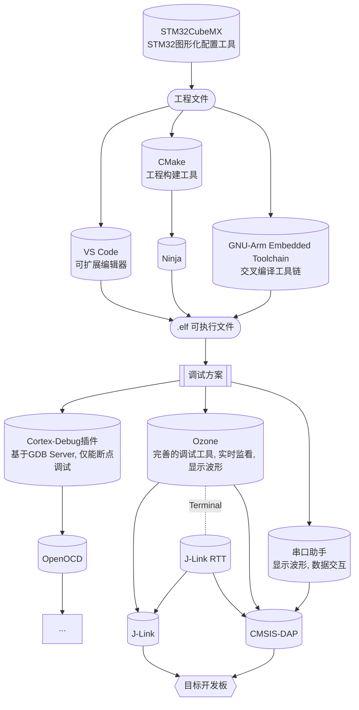

# CubeMX + VS Code + Ozone 配置 STM32 开发环境(Ninja)

 <sp> <sp> 




## 写在前面

针对原有 MDK-ARM 开发环境的诸多不便，我们尝试更换嵌入式开发工具链，以实现更便捷、高效、优雅的嵌入式开发。目前我们已成功配置基于 JetBrains 家族功能齐全的 CLion IDE 的开发方案，为嵌入式开发提供了完善支持，美中不足的是需收费、内存占用较高。另一种轻量化的开源方案是基于 Visual Studio Code，摒弃 IDE，深入掌控项目构建过程。两种方案都值得尝试。此外，我们强烈推荐使用 SEGGER Ozone 进行调试。

下面将介绍使用 CubeMX + VS Code + Ozone 配置 STM32 开发环境所涉及的工具：

`STM32CubeMX`  是一个图形工具，可以非常轻松地配置 STM32 微控制器和微处理器。从 MCU 选型，引脚配置，系统时钟以及外设时钟设置，到外设参数配置，中间件参数配置，它给 STM32 开发者们提供了一种简单，方便，并且直观的方式来完成这些工作。 所有的配置完成后，它还可以根据所选的 IDE 生成对应的工程和初始化 C 代码。

`Visual Studio Code` 是一个轻量级但功能强大的源代码编辑器，适用于 Windows、macOS 和 Linux。它内置了对 JavaScript、TypeScript 和 Node.js 的支持，并为其他语言和运行时（如 C++、C#、Java、Python、PHP、Go、.NET）提供了丰富的扩展生态系统。

`CMake` 是一个开源、跨平台的工具系列，旨在构建、测试和打包软件。CMake 用于使用简单的平台和编译器独立配置文件（`CMakeLists.txt`）来控制软件编译过程，并生成可在您选择的编译器环境中使用的本机 makefile 和工作区。基于 make 工具，交叉编译工具链 `gcc-arm-none-eabi` 被调用并按照 makefile 的指示，将⽂件编译成 arm 架构下的⽂件格式，如 `.elf` `.bin` 等，从⽽供STM32设备使⽤。

生成可执行文件后，可基于 STM32 设备的调试支持模块，选择合适的工具链方案进行调试：

* 首选使用 `Ozone` 调试方案。Ozone 是用于 J-Link 和 J-Trace 的多平台调试器和性能分析器，功能齐全，可实时监看变量、显示波形等，只需载入可执行文件，便可独立进行调试；内置了调试终端，可基于 `J-Link RTT` 与开发板进行非侵入式实时数据交互，无需占用开发板串口资源。

> 注意：在官方说明中，Ozone 仅支持 J-Link。但是我们发现有部分老版本 J-Link 驱动扩展了对 CMSIS-DAP 的支持，但无法保证 J-Link 稳定工作。经过努力，我们成功对这些版本驱动进行逆向破解修改，使得 Ozone 在替换破解的 `JLink_x64.dll` 之后便能同时流畅支持 J-Link 和 CMSIS-DAP.

* 此外，如果希望在 VSCode 中进行 GDB 调试，可使用 `Cortex-Debug 扩展 + GDB Server` 调试方案。此方案不做详细介绍，可自行探索。

    * Cortex-Debug 是一个扩展，用于将 ARM Cortex-M 设备的调试功能添加到 Visual Studio Code。
    
    * GDB Server 建立了调试器到 GDB 的连接。OpenOCD（Open On-Chip Debugger）是一个开源的片上调试器，旨在提供针对嵌入式设备的调试、系统编程和边界扫描功能，支持 `J-Link, CMSIS-DAP, ST-Link` 等多种调试器。OpenOCD 提供了GDB Server，可以通过它进行 GDB 相关的调试操作。此外，针对 J-Link，还可以选用 J-Link GDB Server.
    
    * GDB 调试功能强大，同时可添加 CMSIS SVD (System View Description，系统视图描述文件，`*.svd`格式）以查看外设信息和其他设备参数。唯一的缺点是无法实现实时变量监视。一种解决方案是基于 STM32 的调试支持模块来输出日志，可基于 Semihosting / SWO 实现，或采用更简洁和便捷的 J-Link RTT 方案；另一种方案是通过串口实现实时数据交互，使用串口助手显示波形。上位机串口助手有多种选择，常用的如 `VOFA+`，其除了拥有基本功能外，还能够显示浮点波形，功能丰富。MobaXTrem可以作为不错的调试终端。


## 软件和工具下载

**注意安装路径不要含有中文，最好只含有字母、数字、“-”与“_”**

### STM32CubeMX

* [STM32CubeMX 官网](https://www.st.com/en/development-tools/stm32cubemx.html)下载安装，**版本要求 6.11 及以上**
* 运行该软件需要有 Java 支持

### Visual Studio Code

* [Visual Studio Code 官网](https://code.visualstudio.com/)下载安装

### CMake

* [CMake 官网](https://cmake.org/download/)下载安装，**版本要求 V3.22 及以上**

### Ninja

* [Ninja 编译器](https://github.com/ninja-build/ninja/releases)下载 `ninja-win.zip`

### GNU Arm Embedded Toolchain

* [GNU-ARM 官网](https://developer.arm.com/downloads/-/arm-gnu-toolchain-downloads)下载压缩包，选择 mingw-w64-i686 版本，**版本要求 11.0 及以上**
* 自行选择路径进行解压
* 建议下载后的文件夹重命名下

### J-Link

* [J-Link 官网](https://www.segger.com/downloads/jlink/)下载安装，附带安装 J-Link RTT、J-Link GDB Server 等工具

### Ozone

* [J-Link 官网 Ozone 分区](https://www.segger.com/downloads/jlink/#Ozone)下载安装
* 为了后续替换同时支持 J-Link 和 CMSIS-DAP 的驱动文件后能够正常运行，**建议选择版本 V3.26**

### OpenOCD（可选）

* 预构建版本（适用于windows）[下载](https://gnutoolchains.com/arm-eabi/openocd/)
* 自行选择路径进行解压，路径名不可包含空格

### VOFA+（可选）

* [VOFA+官网](https://www.vofa.plus/)下载

### MobaXTerm（可选）

* [MobaXTerm官网](https://mobaxterm.mobatek.net/download.html)下载


## 环境配置

* Windows 系统搜索 `环境变量-->编辑系统环境变量-->环境变量-->Path（系统变量）-->编辑-->新建`，添加 `arm-none-eabi` 、 `OpenOCD`（可选）安装目录下 `bin` 的路径，同时添加 `ninja.exe` 所在文件夹的路径
* 在终端测试是否安装成功

```shell
ninja --version
arm-none-eabi-gcc -v
openocd -v
```

- 在VS Code中安装相关扩展：

    .assets/vscode00.png)

    * C/C++

    * CMake

    * CMake Tools

    * koroFileHeader（生成源码文件模板，具体配置内容请参考编程风格指南，可选）

    * Cortex-Debug（用于 GDB 调试，可选）

- 其他 VS Code 配置不是必须的，请参考一般的教程


## 开发

### STM32CubeMX 生成工程

* 工程配置方法请参考其他教程
* 生成工程时，在 `Project Manager-->Project-->Toolchain/IDE` 选项选择 `CMake`，勾选 `Generate Under Root`；其它一些选项建议按下图选择
* 点击右上角的 GENERATE CODE 生成代码

.assets/cubemx01.png)

.assets/cubemx00.png)

### 使用 VS Code 编辑

* 用 VS Code  打开工程文件夹，目录结构如下
    * 其中 `.mxproject` 可删去
    * `CMakeLists.txt` 删去，后续换为提供的[模板](#cmakelists-%E6%A8%A1%E6%9D%BF)
    * `.ld` 为链接脚本文件，在链接时使用，本目录下的 `.ld` 规定了设备内存相关信息
    * `Core/` `Drivers/` 为 CubeMX 按照模板生成的文件，除 `Core/Src/main.c` 外一般不做改动
    * `cmake` 为 CubeMX 根据不同 stm32 型号生成的 cmake 配置文件
    * `CMakePresets.json` 为 cmake 的预先配置

.assets/vscode01.png)

* 在工程根目录添加子目录和文件，在 VS Code 中编辑

  > 注意：若开发工程与战队相关、需要队内共享或合作或开源，请遵循文件组织规范、代码架构规范和风格指南

* 一些常用的快捷键：
  
   | 快捷键                 | 说明                 |
   | ---------------------- | -------------------- |
   | `Ctrl` + `Shift` + `p` | 显示命令面板         |
   | `Ctrl` + `p`           | 快速打开，转到文件   |
   | `Ctrl` + `Tab`         | 切换已打开的文件     |
   | `Ctrl` + `,`           | 编辑器设置           |
   | `Ctrl` + `F`           | 在当前文件中查找     |
   | `Ctrl` + `Shift` + `F` | 在所有项目文件中查找 |
   | `Alt` + `→` / `←`      | 前进 / 后退          |
   | `Alt` + `↑` / `↓`      | 向上 / 向下移动行    |
   | `Shift` + `Alt` + `F`  | 格式化代码           |
   | `F2`                   | 重命名变量           |
   | ...                    | ...                  |
	
  > 更多快捷键列表可通过 `Ctrl + K, Ctrl + S` 唤出
   
* 更多 VS Code 功能可参考[官方文档](https://code.visualstudio.com/docs)，从中选择感兴趣的话题学习

### 配置 CMake 工程

* 添加 `CMakeLists.txt` [模板](#cmakelists-%E6%A8%A1%E6%9D%BF)至工程根目录，修改模板中的 `TODO` 内容，主要包括：

    * 工程名
    * 用户使用的文件夹
    * 队伍组件所在文件夹
    * 组件内部默认配置的重写
    * 添加个人的 `*.cmake` 文件


  > 注意：若更改 `CMakeLists.txt` 中的 `option`、`set` 等，运行配置肯并不会更新选项，此时需要需要删除 `build` 目录重新配置

* 运行配置：

    * 可以通过更改构建类型来运行配置
    * 或者修改 CMakeLists 并保存，将自动配置
    * 或者通过从命令面板运行 *CMake: Configure* 命令
    * 或者在尚未进行配置时直接运行 *build* ，其中包含了配置步骤
    * 或在项目根目录下使用命令行：

  ```shell
  mkdir build
  cd build
  cmake ..
  ```

* 至此，已完成了 CMake 工程的所有配置。若配置成功，应当输出类似的信息

  .assets/cmake02.png)

### 修改工程

* 在工程根目录添加、删除或重命名子目录和文件，可直接在 Windows 资源管理器中操作或在 VS Code 资源管理器中操作
* 此外，还需要修改 CMakeLists.txt，包括更新头文件所在目录 （include_directories）、添加源文件（file）
* 在添加、删除或重命名文件后需要重新运行 CMake 工程配置，否则后续的工程构建将报错
* 必要时删除 `build/` 目录重新配置和构建

### 构建工程

* 从命令面板运行 *CMake: Build* 命令（快捷键 `F7`），该命令具有跨平台的特性

  .assets/build_command.png)
  
  或者点击状态栏中的 *Build*:

  .assets/build_button.png)

* 或使用命令行，加入 `-jn` 以指定使用 `n` 线程编译，如 `-j10`：

  ```shell
  cd build
  make -j
  ```

* 若构建成功，应当输出类似的信息：

  .assets/cmake03.png)

* 默认情况下，CMake 工具将构建输出写入 `build/` 子目录。该目录下可找到调试所需的 `.elf` 文件

## 调试

### 使用 Ozone

#### 破解

破解后，Ozone V3.26 及之前的 V3.xx 版本均能够同时支持 J-Link 和 CMSIS-DAP。

* 安装 Ozone 后，将目录下的 `JLink_x64.dll` 文件替换为破解版本 [下载](https://g6ursaxeei.feishu.cn/wiki/wikcno8IDCTKHQWGDTOOzQFLyMg)

* **使用 CMSIS-DAP 调试时**，Ozone 会弹窗提示设备没有 License，此问题可通过在 J-Link License Manager 注册解决。若还不清楚如何用 Ozone 创建项目，可之后再进行此步骤。注册流程为：

    * 下载 J-Link / J-Flash 注册机 [下载](https://g6ursaxeei.feishu.cn/wiki/wikcno8IDCTKHQWGDTOOzQFLyMg)

    * 连接好 CMSIS-DAP 调试器，使用 `New Project Wizard` 新建工程，进行到下图所示步骤，读取调试器序列号：

      .assets/image-20221125211505428.png)

	> 或先用 Ozone 开启调试，然后点击 Windows 任务栏托盘区的 .assets/icon-jl.png) 图标开启 J-Link 控制面板，也能够读取序列号：.assets/panel-jl.png)

	* 将序列号输入注册机生成 License，然后开启 J-Link License Manager（已与 J-Link 捆绑安装），添加 License：

	.assets/license-jl.png)

#### 创建项目

* 添加对应 `*.svd` 文件（CMSIS SVD，系统视图描述文件，可选）至工程根目录下以支持查看外设信息和其他设备参数 [下载](https://github.com/cmsis-svd/cmsis-svd/tree/drop-old-python-versions-from-ci/data/STMicro)

* 进入 Ozone，选择 `File-->New-->New Project Wizard`：
    * 选择目标开发板对应的 Device（如 STM32F407IG）, Register Set（如 Cortex-M4 (with FPU)）；Peripherals (optional) 选择对应的 `.svd` 文件 ，按 Next
    * 选择 Target Interface = SWD, Target Interface Speed  = 4MHz （默认）或合适的速率，Host Interface = USB；若连接了多个调试器，选择需要使用的那个，按 Next
    * 选择要调试的可执行文件（如 `.elf`），按 Next
    * 如无特殊要求，其他选项保持默认即可

* 点击 `File-->Save Project as`，将 `.jdebug` 格式调试文件保存至工程根目录下

#### 下载调试

* 点击左上角绿色图标，下载并复位程序，点击工具栏按钮进行调试

  .assets/ozone00.png)

> 注意：**使用 CMSIS-DAP 时**，若要退出调试，请不要点击.assets/icon00.png)，否则会导致闪退，目前我们尚未解决这个问题；但这个问题并不影响调试，一般点击 .assets/icon01.png) 按钮组合即可执行运行、停止、复位操作，非运行状态下可进行增删窗口、变量、波形等操作
> **使用 J-Link 则一切功能正常**

* 操作和一般的调试器类似，运行、复位、单步运行、打断点
* 开启 `View` 标签下的各种窗口以观察调试信息：
    * `Call Stack` 查看调用栈
    * `Global Data` 及 `Local Data` 在程序暂停时更新变量
    * `Register` 查看外设信息
    * `Watched Data` 能够实时更新变量，在该窗口中右键设定刷新频率
    * `Data Sampling` 能够实时采集数据，配合 `Timeline` 实现波形可视化，并可导出为 `.csv` 格式；`Timeline` 还可展示功耗和程序执行信息
    * `Source Files` 展示工程源文件，可搜索希望打开的文件，以方便断点调试
* 右键开启快捷菜单可将变量添加到窗口，或执行其他快捷操作。关于键盘快捷键的使用可自行探索
* 若需要编辑源码，建议在 VS Code 中修改编译，无需退出调试，Ozone 将自动检测并提示重新加载可执行文件

#### 实时传输（Real Time Transfer）

* J-Link RTT 基于调试器建立主机和目标开发板之间的非侵入式交互，需要目标开发板中调用接口编写对应的程序，处理交互信息
* 开启 Ozone 内置的 `Terminal` 窗口，可接收日志或作为终端执行在线调试
* 也可使用其他软件以建立多个终端
* RTT 的相关信息请参考[官方Wiki](https://wiki.segger.com/RTT)，或查阅 Ozone 安装目录下的 `UM08025_Ozone.pdf` 手册

#### 更多功能介绍

.assets/ozone01.png)

* `View` 标签下的窗口包含了 Ozone 的大部分功能。静态下可观察可执行文件的静态信息；开始调试后，能够观察更多动态信息
* 实现C/C++源代码级调试和汇编指令调试；调试信息包括：反汇编、内存、全局变量和局部变量、（实时）监视、CPU和外设寄存器等；可展示RTOS内核相关信息
* 可作为编辑器直接修改源代码（但并没有良好的支持，不建议这么做）
* 可直接使用 J-Link 内置功能（无限Flash断点、Flash下载、实时终端RTT、指令Trace）
* 可编程，支持编写脚本进行自动化调试
* 更多功能自行探索，或查阅 Ozone 安装目录下的 `UM08025_Ozone.pdf` 手册

## 附录

### CMakeLists 模板

```cmake
# ##############################################################################
# #################        CMake Template (CUSTOM)       ######################
# #################    Copyright (c) 2023 Hello World    ######################
# ##############################################################################

# Set the system name and version
set(CMAKE_SYSTEM_VERSION 1)

# Specify the minimum required version of CMake
cmake_minimum_required(VERSION 3.22)

include("cmake/gcc-arm-none-eabi.cmake")

# Set the C++ and C standards
set(CMAKE_CXX_STANDARD 20)
set(CMAKE_CXX_STANDARD_REQUIRED ON)
set(CMAKE_CXX_EXTENSIONS ON)
set(CMAKE_C_STANDARD 11)
set(CMAKE_C_STANDARD_REQUIRED ON)
set(CMAKE_C_EXTENSIONS ON)

# Set the library path
set(CMAKE_LIBRARY_PATH "${CMAKE_CURRENT_SOURCE_DIR}/Lib")
set(CMAKE_RUNTIME_OUTPUT_DIRECTORY ${CMAKE_SOURCE_DIR}/build)

# ########################## USER CONFIG SECTION ##############################
# Set the project name and the languages used
project(your_project_name C CXX ASM) # TODO: change project name here

# Specify user folders
set(user_folders "folder1" "folder2") # TODO Add your own user folders here

# Specify the path to the HW-Components directory
set(HWC_DIR "HW-Components") # TODO: Set your own HW-Components path here

# Include utility functions and default configuration
include("${HWC_DIR}/cmake/utils/function_tools.cmake")
include("${HWC_DIR}/config.cmake") # Default configuration

# TODO: Overwrite default configuration instead of changing it in file
# tools
# set(use_hwcomponents_tools ON)
# set(use_prebuilt_hwcomponents_tools OFF)
# set(... ON)

# TODO: Add your own `config.cmake` file or set your own configuration here

# Enable preprocessing for assembler files
add_compile_options($<$<COMPILE_LANGUAGE:ASM>:-x$<SEMICOLON>assembler-with-cpp>)

# Disable some warnings
set(COM_FLAGS "-Wno-unused-parameter -Wno-missing-field-initializers -Wno-pedantic -Wno-unknown-pragmas")
set(CMAKE_C_FLAGS "${CMAKE_C_FLAGS} ${COM_FLAGS}")
set(CMAKE_CXX_FLAGS "${CMAKE_CXX_FLAGS} ${COM_FLAGS} -Wno-reorder")

add_subdirectory(cmake/stm32cubemx)
get_target_property(STM32_COMPILE_DEFINES stm32cubemx INTERFACE_COMPILE_DEFINITIONS)
list(APPEND STM32_COMPILE_DEFINES DEBUG) # Add DEBUG definition
foreach(STM32_COMPILE_DEFINE ${STM32_COMPILE_DEFINES})
  # Exclude the element if it starts with "$"
  if(STM32_COMPILE_DEFINE MATCHES "^\\$")
    continue()
  endif()
  add_definitions(-D${STM32_COMPILE_DEFINE})

  # Get HAL filename
  if(STM32_COMPILE_DEFINE MATCHES "STM32[A-Z][0-9]")
    string(SUBSTRING ${STM32_COMPILE_DEFINE} 0 7 STM32_DEVICE)
    string(TOLOWER ${STM32_DEVICE} stm32_hal_filename)
    string(CONCAT stm32_hal_filename ${stm32_hal_filename} "xx_hal.h")
    message(STATUS "HAL file name: ${stm32_hal_filename}")
    # Set macro for the HAL filename
    add_definitions(-DSTM32_HAL_FILENAME="${stm32_hal_filename}")
  endif()
endforeach()

# #################### ADD LIBRARIES AND EXECUTABLE SECTION ####################
# Initialize source and include lists
set(project_srcs)
set(project_incs)

# Search for include files and source files in the Core directory
search_incs_recurse("${CMAKE_CURRENT_SOURCE_DIR}/Core" core_incs)
file(GLOB_RECURSE core_srcs "Core/*.*")
list(APPEND project_srcs ${core_srcs})
list(APPEND project_incs ${core_incs})

# Search for include files and source files in the Drivers directory
search_incs_recurse("${CMAKE_CURRENT_SOURCE_DIR}/Drivers" drivers_incs)
file(GLOB_RECURSE drivers_srcs "Drivers/*.*")
list(APPEND project_incs ${drivers_incs})

# For each user folder, search for include files and source files
foreach(user_folder ${user_folders})
  search_incs_recurse("${CMAKE_CURRENT_SOURCE_DIR}/${user_folder}"
                      ${user_folder}_incs)
  file(GLOB_RECURSE ${user_folder}_srcs "${user_folder}/*.*")
  list(APPEND project_incs ${${user_folder}_incs})
  list(APPEND project_srcs ${${user_folder}_srcs})
endforeach()

# Add a static library for the drivers
add_library(drivers STATIC ${drivers_srcs})
target_include_directories(drivers PUBLIC ${core_incs} ${drivers_incs})

# Add the HW-Components directory as a subdirectory
add_subdirectory(${HWC_DIR})

# Add an executable for the project
file(GLOB_RECURSE startup_file "*.s")
add_executable(${PROJECT_NAME} ${project_srcs} ${startup_file})
message(STATUS "Project name: ${PROJECT_NAME}")

# Add the project includes to the executable
target_include_directories(${PROJECT_NAME} PUBLIC ${project_incs})
target_include_directories(${PROJECT_NAME} PUBLIC ${${HWC_LIB_PREFIX}_incs})

# Link the drivers library and the HW-Components library to the executable
target_link_libraries(${PROJECT_NAME} PUBLIC drivers)
target_link_libraries(${PROJECT_NAME} PUBLIC ${${HWC_LIB_PREFIX}_libs})

# Define the output hex and bin files
set(HEX_FILE ${PROJECT_BINARY_DIR}/${PROJECT_NAME}.hex)
set(BIN_FILE ${PROJECT_BINARY_DIR}/${PROJECT_NAME}.bin)

# Add a post-build command to generate the hex and bin files
add_custom_command(
  TARGET ${PROJECT_NAME}
  POST_BUILD
  COMMAND ${CMAKE_OBJCOPY} -Oihex $<TARGET_FILE:${PROJECT_NAME}> ${HEX_FILE}
  COMMAND ${CMAKE_OBJCOPY} -Obinary $<TARGET_FILE:${PROJECT_NAME}>
          ${BIN_FILE}
  COMMENT "Building ${HEX_FILE} Building ${BIN_FILE}")
```

### 参考资料

[1] 薛东来. CubeMX+VSCode+Ozone 配置 STM32 开发环境.

[2] <https://www.st.com/en/development-tools/stm32cubemx.html>

[3] <https://cmake.org/>

[4] <https://www.segger.com/products/development-tools/ozone-j-link-debugger/>

[5] <https://openocd.org/>

[6] <https://github.com/Marus/cortex-debug/wiki>

### 版本说明

| 版本号                                                  | 发布日期   | 说明   | 贡献者 |
| ------------------------------------------------------- | ---------- | ------ | ------ |
|  | 2024.04.07 | 预发布 | 蔡坤镇 |
