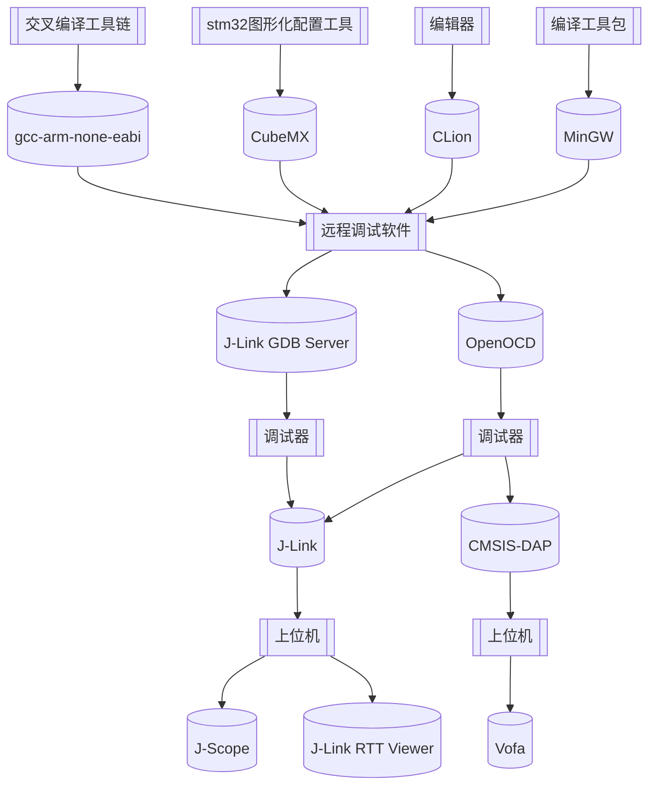

# CubeMX + CLion 配置 STM32 开发环境

 <sp> <sp> 



## 写在前面

​		交叉编译链 gcc-arm-none-eabi 的作用，是将文件编译成 arm 架构下的文件格式，如 `elf, axf, bin`，从而供主控板使用。

​		编译工具包 MinGW 提供了 gcc、cmake 等工具，其安装是==可选项==，因为 CLion 捆绑了 MinGW-w64 9.0 版本。

​		远程调试指的是在本地主机上对开发板上运行的应用程序进行调试，其需要两个 GDB 程序，运行在远程设备上的程序称之为 GDB Server，运行在本地主机上的 GDB 程序为交叉编译器。

​		OpenOCD 和 JLinkGDBServer 都属于 GDB Server。OpenOCD 支持 J-Link、ST-Link、CMSIS-DAP（无线调试器） 等多种调试器，但是配置流程稍显复杂，且在使用 CMSIS-DAP 时只能用串口调试助手查看曲线，会占用主控板一个串口。JLinkGDBServer 只支持 J-Link，但是配置和烧录流程会简单一些。

​		在配置前，可以根据是否需要 CMSIS-DAP 决定选用哪一个调试软件，如果无需 CMSIS-DAP，则建议选用 JLinkGDBServer。当然，如果不确定使用哪个调试软件，也可按照教程一起进行配置，二者并不冲突，可以在不同场合进行切换。


## 软件下载

### CLion

- 注册 JetBrains 账号，进行学信网认证，获得浙江大学提供的免费使用权（未激活可有30天免费试用机会）
- 如果浙大邮箱无法使用，在[激活网站](https://foxirj.com/jetbrains-crack-code)中破解
- [CLion官网](https://www.jetbrains.com/clion/)下载安装包，使用 JetBrains 账号登录即可
- 安装时可选的 Options 全都勾上
  

### CubeMX

- [STM32CubeMX官网](https://www.st.com/en/development-tools/stm32cubemx.html)下载安装包

### gcc-arm-none-eabi

- [gcc-arm-none-eabi官网](https://link.zhihu.com/?target=https%3A//developer.arm.com/tools-and-software/open-source-software/developer-tools/gnu-toolchain/gnu-rm/downloads)下载压缩包
- 解压后自行修改安装路径

### J-Link

- [J-Link官网](https://www.segger.com/downloads/jlink/)下载V7及以上版本，会附带 J-Scope、JLinkGDBServer等重要工具

### OpenOCD

- [OpenOCD官网](https://link.zhihu.com/?target=https%3A//gnutoolchains.com/arm-eabi/openocd/)下载安装包
- 文件夹==不可放置在有空格的路径下==（如`Program Files`），可直接放置在C盘根目录下

### MinGW（可选）

- [MinGW官网](https://bit.ly/mingw10)下载安装包
- 默认安装在C盘`Program Files`目录下，可自行修改路径


## 环境配置

- 搜索"环境变量"-->"编辑系统环境变量"-->"环境变量"-->"Path"-->"编辑"-->"新建"，添加解压路径中的三个`bin`目录。
- 如果 MinGW 事先已安装且有 conda 环境，安装 conda 时会自动修改MinGW路径，二者等价。
  
  

  

- 在终端测试是否安装成功
  ```powershell
  gcc -v                # mingw
  openocd -v            # openocd
  arm-none-eabi-gcc -v  # eabi
  ```


## Clion配置

**Clion --> File --> Settings --> Build, Execution, Deployment**

- Toolchains
  - **Toolset**：配置 MinGW 路径，用 CLion 默认捆绑的即可，也可以用自己下载的版本
  
  

- CMake
  
  - **Build directory**：cmake-build-debug 为编译生成的 .elf 文件所在目录（无需修改）
  
  

- Embedded Deveploment
  - **OpenOCD Location**：OpenOCD 路径，不可有空格
  - **Stm32CubeMX Location**：CubeMX 路径
  - 点击 Test 可进行测试
  
  


## 创建工程

### 基本配置

**Clion --> File --> New --> Project --> STM32CubeMX**

- **Location**：工程==文件夹==的位置


​		创建后会自动成 Location 中所给文件夹，以及同名的 .ioc 文件，默认是 STM32030F4Px 芯片，点击 Open with STM32CubeMX，在 CubeMX 中重新配置。


**CubeMX --> Project Manager**

- **Project Name**：对应 Clion 中 .ioc 文件的名字（demo.ioc）
- **Project Location**：对应 Clion 工程目录的根目录而非文件夹名（demo文件夹的根目录为Desktop）
- **Toolchain Folder Location**：对应 Clion 中的文件夹名（demo文件夹）
- **Toolchain / IDE**：选择 STM32CubeIDE，（==不要选== SW4STM32，即将失效）
- **Generate Under Root**：勾选
- 配置完成后 GENERATE CODE，第一次生成是会出现 overrun 选项，选==是==（CubeMX配置时先进行以上步骤是为了避免在完成了前面的外设配置后因路径问题导致重配）
- 若路径有误（第一次生成时没有出现overrun选项）或 Toolchain选择有误（生成的文件目录非后图所示），需删除新生成的文件夹，返回 Clion 中 Open with STM32CubeMX 重新配置


**返回 Clion**

​		Clion 中会跳出配置文件的选项，可以选择最相近的 stm32f4discovery.cfg，然后点击 Copy to Project & Use，工程目录下就会出现该配置文件，方便之后修改。（也可先取消，之后再配置）


​		至此，工程文件基本配置完成，文件结构如下图所示，可返回 CubeMX 继续配置外设。


### CMakeLists.txt

​		整个编译流程是利用 cmake 工具生成了 CMakeList.txt，再根据 CMakeLists.txt 生成了 Makefile 用于编译，所以所有的编译规则都可以在 CMakeLists.txt 中规定，并且会覆盖编辑器中的相关配置。本项目中编译链的设置就在 CMakeLists.txt 自动配置完成，会覆盖之前 Toolchains 中的配置。
​		


### 添加文件

​		直接在左侧工程目录下添加所需文件，然后在 CMakeLists.txt 中添加相应文件。

- **include_directories**：头文件
- **file**：源文件


​		==文件在添加、重命名或删除后需要在下方工具栏 CMake 中 Reload CMake Project，否则会找不到原本编译链中的文件。==


### 修改工程名

- 删除 CLion 调试文件夹 `cmake-build-debug`

- 修改工程文件名字 `xxx.ioc`

- CMakeLists.txt 中修改 project 处修改对应的文件名，然后右上角 Reload changes（与上图 Reload CMake Project 作用相同）

  


## 编译

​		点击右上角的锤子即可编译，终端显示 Linking .elf 文件 和 Build finished 即编译成功。


## 烧录 & 内部调试

### J-Link GDB Server

​		CLion 新建的工程默认使用 OpenOCD，点击 Debug --> Edit Configuration --> 左上角"+" --> Embedded GDB Server，完成相关配置。


- **Name**： 自行选择
- **Target / Executable**：对应的.elf文件
- **Downloaded executable**：进入调试模式时，每次都烧录（Always） / .elf文件更新时才烧录（Updated Only）
- **'target remote' args**：tcp端口号，`tcp::<port>`
- **GDB Server**：J-Link 安装目录下的 JLinkGDBServer 可执行文件（不要选带CL的CLion版本）
- **GDB Server args**：烧录参数（设备、速率），`-device STM32F407IG -if SWD -speed 4000k`

​		JLinkGDBServer 没有单独的烧录选项，是在进入调试模式时进行代码的烧录（Downloaded executable 选项），点击右上角虫子进行调试&烧录，CLion 会自动打开底部 Debug 工具栏。


​		JLinkGDBServer 会首先检查是否连接 J-Link 和主控板，第2、3行亮绿灯表示通过。

- 如果二三行都为红灯，检查 J-Link 是否连接以及 J-Link 驱动是否安装。   
- 如果第三行为红灯，检查 J-Link 与主控板是否连接。


​		然后进行 tcp 连接，第一行亮绿灯后自动烧录代码。


​		烧录完成后若关闭 JLinkGDBServer 界面或断开 J-Link 连接，则退出调试模式，否则仍处于调试模式。

#### 查看变量

​		Variables 中可以添加变量，CLion 不能在程序运行时查看实时变量，只能通过打断点的方式查看此刻变量值，但是可以查看局部变量。

​		点击左侧绿色箭头，程序会运行至下一个断点处（while循环中即重新回到此处），可以看到此时全局变量和局部变量都发生了改变，且变量值会显示在变量定义处（95行）。


​		如果变量后出现了`<optimized out>`的字样，说明编译器自动对其进行了优化，导致其值不可见，一般是由于该变量未被使用（第二段程序有所修改）。


​		如果需要取消此优化，在 CMakeList.txt 中修改编译器的优化指令，加在50行之后以覆盖之前的指令，`add_compile_options(-O0)`，-O0 代表不优化。调试结束后改回，否则影响编译效率。


#### 查看寄存器

​		Peripherals 中加载对应芯片的 .svd 文件。

- 如果有安装过 KEIL，可以在安装子目录中中找到：`C:\Users\HTY\AppData\Local\Arm\Packs\Keil\STM32F4xx_DFP\2.16.0\CMSIS\SVD\STM32F40x.svd`。


- 也可在 [github链接](https://github.com/posborne/cmsis-svd/tree/master/data/STMicro) 上下载对应的文件，放在根目录后选择该文件即可。 

​		选择 .svd 文件后即可查看相应寄存器的值，这里点亮了C板上的蓝灯，即拉高 `GPIOH` 下的 `GPIO_PIN_10`的引脚，可以看到 GPIOH 寄存器 IDR 中的第10位发生改变被置位。


### OpenOCD

​		点击 Debug --> Edit Configuration，可以看到 Board config file 已自动配置了之前选择的 .cfg 文件，点击 Assist 可选则 OpenOCD 提供的其他模板配置文件（也可选择自己定义的文件）。


#### ST-Link

​		打开 .cfg 配置文件，默认是 ST-Link 烧录器，==需要将最后一行的 `reset_config srst_only` 改为 `reset_config none`，或者直接删除==。其中的 interface 和 target 文件夹即 OpenOCD 路径 `C:\openocd\share\openocd\scripts\ ` 下的两个目录。


#### J-Link

​		若使用 J-Link 烧录器，则修改为如下代码。

```powershell
source [find interface/jlink.cfg]

transport select swd

# increase working area to 64KB
set WORKAREASIZE 0x10000

source [find target/stm32f4x.cfg]

reset_config none
```

​		同时，由于 OpenOCD 使用 J-Link 的方式很低级，所以我们需要把 J-Link 原来的驱动更换为 WinUSB 驱动才可以被 OpenOCD 识别。[USBDriverTool官网](https://visualgdb.com/UsbDriverTool/)下载安装包，打开后右击 J-Link driver --> Install WinUSB。


#### CMSIS-DAP

​		若使用 CMSIS-DAP 无线烧录器，则修改为如下代码。

```powershell
source [find interface/cmsis-dap.cfg]

transport select swd

# increase working area to 64KB
set WORKAREASIZE 0x10000

source [find target/stm32f4x.cfg]

reset_config none
```

​		修改完配置后点击右上角箭头完成烧录。


​		点击右上角的虫子进行调试。


​		在初始化锁相环的时候会出现卡死的情况，原因是 HAL 库与 OpenOCD 对时钟的配置所导致，具体原因见[OpenOCD在debug时PLL卡死问题](https://blog.t123yh.xyz:2/index.php/archives/922)。


解决方案：

- 在单片机进入 main 函数时，把系统时钟来源设为 HSI。​(推荐)
  
```c_cpp
int main(void)
{
  __HAL_RCC_HSI_ENABLE();
  __HAL_RCC_SYSCLK_CONFIG(RCC_SYSCLKSOURCE_HSI);
  HAL_Init();
  SystemClock_Config();
}  
```

- 或者将 main 文件中的 SystemClock_Config 函数作如下修改。

```c_cpp
void SystemClock_Config(void)
{
    RCC_OscInitTypeDef RCC_OscInitStruct = {0};
    RCC_ClkInitTypeDef RCC_ClkInitStruct = {0};

    /** Configure the main internal regulator output voltage
    */
    __HAL_RCC_PWR_CLK_ENABLE();
    __HAL_PWR_VOLTAGESCALING_CONFIG(PWR_REGULATOR_VOLTAGE_SCALE1);

    // 先将时钟源选择为内部时钟
    RCC_ClkInitStruct.ClockType = RCC_CLOCKTYPE_SYSCLK;
    RCC_ClkInitStruct.SYSCLKSource = RCC_SYSCLKSOURCE_HSI;
    if (HAL_RCC_ClockConfig(&RCC_ClkInitStruct, FLASH_LATENCY_5) != HAL_OK)
    {
        Error_Handler();
    }

    // 初始化锁相环
    RCC_OscInitStruct.OscillatorType = RCC_OSCILLATORTYPE_HSE;
    RCC_OscInitStruct.HSEState = RCC_HSE_ON;
    RCC_OscInitStruct.PLL.PLLState = RCC_PLL_ON;
    RCC_OscInitStruct.PLL.PLLSource = RCC_PLLSOURCE_HSE;
    RCC_OscInitStruct.PLL.PLLM = 6;
    RCC_OscInitStruct.PLL.PLLN = 168;
    RCC_OscInitStruct.PLL.PLLP = RCC_PLLP_DIV2;
    RCC_OscInitStruct.PLL.PLLQ = 4;
    if (HAL_RCC_OscConfig(&RCC_OscInitStruct) != HAL_OK)
    {
        Error_Handler();
    }

    // 锁相环已经初始化完毕了，将时钟源在切换回外部时钟源
    RCC_ClkInitStruct.ClockType = RCC_CLOCKTYPE_HCLK|RCC_CLOCKTYPE_SYSCLK
                                  |RCC_CLOCKTYPE_PCLK1|RCC_CLOCKTYPE_PCLK2;
    RCC_ClkInitStruct.SYSCLKSource = RCC_SYSCLKSOURCE_PLLCLK;
    RCC_ClkInitStruct.AHBCLKDivider = RCC_SYSCLK_DIV1;
    RCC_ClkInitStruct.APB1CLKDivider = RCC_HCLK_DIV4;
    RCC_ClkInitStruct.APB2CLKDivider = RCC_HCLK_DIV2;
    if (HAL_RCC_ClockConfig(&RCC_ClkInitStruct, FLASH_LATENCY_5) != HAL_OK)
    {
        Error_Handler();
    }

    // 禁用内部高速时钟
    RCC_OscInitStruct.OscillatorType = RCC_OSCILLATORTYPE_HSI;
    RCC_OscInitStruct.HSIState = RCC_HSI_OFF;
    RCC_OscInitStruct.PLL.PLLState = RCC_PLL_NONE;
    if(HAL_RCC_OscConfig(&RCC_OscInitStruct) != HAL_OK)
    {
        Error_Handler();
    }
}
```

​		具体调试方法与 JLinkGDBServer 中所介绍的相同。


## 外部调试

### J-Link RTT Viewer

​		找到 J-Link 安装目录下的 RRT 文件夹，下图中的压缩包不用解压缩，直接点进去将所需文件复制到工程目录即可。


​		所需文件为 Config 文件夹下的 `SEGGER_RTT_Conf.h` 和 RTT 文件夹下的 `SEGGER_RTT.c`、`SEGGER_RTT.h`、`SEGGER_RTT_printf.c`。


​		将以上四个文件复制到工程目录下，修改 CMakeLists.txt 与之匹配。同时将 `SEGGER_RTT.h` 中 `#include "../Config/SEGGER_RTT_Conf.h"` 改为 CMakeLists.txt 中所包含的路径 `#include "SEGGER_RTT_Conf.h"`（Config文件夹不存在）。


​		编写如下测试代码，需要包含头文件 `#include "SEGGER_RTT.h"`。程序向两个终端发送不同变量的值，分别为红色的绿色，在 JLinkRTTViewer 中输入‘空格’或‘q’可以改变变量的值。

```c_cpp
  while (1)
  {
      HAL_GPIO_TogglePin(GPIOH, GPIO_PIN_10);
      int ch = SEGGER_RTT_GetKey();
      if (ch == ' ')
      {
          global_flag = 1;
          local_flag = 1;
      }
      else if (ch == 'q')
      {
          global_flag = 2;
          local_flag = 2;
      }

      SEGGER_RTT_SetTerminal(0);
      SEGGER_RTT_printf(0, RTT_CTRL_TEXT_RED"global: %d\r\n", global_flag);
      SEGGER_RTT_SetTerminal(1);
      SEGGER_RTT_printf(0, RTT_CTRL_TEXT_GREEN"local: %d\r\n", local_flag);

      HAL_Delay(800);

    /* USER CODE END WHILE */
    /* USER CODE BEGIN 3 */
  }
```

​		打开 JLinkRTTViewer，下拉箭头选择对应芯片。可以同时打开两个以方便观察不同终端的输出。更多功能详见[官网](https://www.segger.com/products/debug-probes/j-link/tools/rtt-viewer/)。


### J-Scope

- **Specify Target Device**：​输入对应芯片（IG要大写）
- **Sampling Rate**：采样间隔需大于20000us，因为采样频率从最大50Hz
- **Elf File**：选择工程目录下 cmake-build-debug 中的 .elf 文件


​		如果之前更改了 USB 驱动，需要用 USBDriverTool 恢复。


### Vofa

​		使用无线烧录器时需用 Vofa 或其他串口调试助手查看数据。


## 其他

### printf重定向

详见[稚晖君教程](https://zhuanlan.zhihu.com/p/145801160)

### CLion添加文件头部注释

[CLion自动添加文件头部注释](https://blog.csdn.net/qq_39161804/article/details/83865853)

### CLion常用快捷键

- `ctrl` + `左键`：转到定义
- `ctrl` + `F`：当前文件搜索
- `ctrl` + `shift` + `F`：当前工程搜索（全局搜索）
- `ctrl` + `R`：当前文件替换
- `ctrl` + `shift` + `R`：当前工程替换（全局替换）
- `ctrl` + `space`：自动补全提示
- `ctrl` + `D`：复制当前行
- `ctrl` + `/`：添加注释
- `alt` + `→`：切换文件

### 修改缩进

​		CubeMX 生成的代码默认的缩进为 2 spaces，可使用 vscode 进行修改，这种方法只能单个文件修改，且CubeMX 重新 generate code 后仍会变成默认缩进，[修改缩进（vscode）](https://blog.csdn.net/spiremoon/article/details/111519064)。


## 附录
### 参考资料

[CLion官网](https://www.jetbrains.com/help/clion/embedded-overview.html)

[整体配置教程1（稚晖君）](https://zhuanlan.zhihu.com/p/145801160)

[整体配置教程2](https://zhuanlan.zhihu.com/p/478097828)

[整体配置教程3](https://segmentfault.com/a/1190000022798805?utm_source=tag-newest)

[整体配置教程4](http://events.jianshu.io/p/c5c7a45e0b35)

[JLinkGDBServer教程](https://blog.csdn.net/zjh1229/article/details/123887084)

[GDB命令行指令](https://www.cnblogs.com/sky-heaven/p/15800270.html)

[JLinkRTTViewer官网](https://www.segger.com/products/debug-probes/j-link/tools/rtt-viewer/)

[JLinkRTTViewer教程1](https://blog.csdn.net/qq1291917670/article/details/119414735)

[JLinkRTTViewer教程2](https://blog.csdn.net/qq_23852045/article/details/108759582)

[OpenOCD路径空格问题](https://blog.csdn.net/weixin_39946218/article/details/123532558)

[OpenOCD在debug时PLL卡死问题](https://blog.t123yh.xyz:2/index.php/archives/922)

[CLion自动添加文件头部注释](https://blog.csdn.net/qq_39161804/article/details/83865853)

[修改缩进（vscode）](https://blog.csdn.net/spiremoon/article/details/111519064)

### 版本说明
  
| 版本号                                                | 发布日期   | 说明                           | 贡献者 |
| ----------------------------------------------------- | ---------- | ------------------------------ | ------ |
|  | 2022.09.01 | 基本配置                         | 胡天扬 |
|  | 2022.09.03| 添加debug流程                       | 胡天扬 |
|  | 2022.09.03 | 添加其他clion功能 | 胡天扬 |
|  | 2022.09.04 | 添加RTT流程 | 胡天扬 |
|  | 2022.09.04 | 删除mingw | 胡天扬 |
