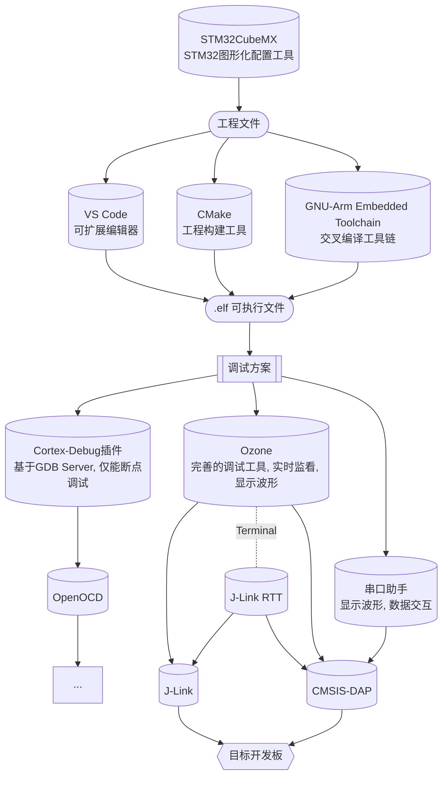

# CubeMX + VS Code + Ozone 配置 STM32 开发环境 (Windows 系统)





## 写在前面

`STM32CubeMX`  是一个图形工具，可以非常轻松地配置 STM32 微控制器和微处理器。从 MCU 选型，引脚配置，系统时钟以及外设时钟设置，到外设参数配置，中间件参数配置，它给 STM32 开发者们提供了一种简单，方便，并且直观的方式来完成这些工作。 所有的配置完成后，它还可以根据所选的 IDE 生成对应的工程和初始化 C 代码。

`Visual Studio Code` 是一个轻量级但功能强大的源代码编辑器，可在您的桌面上运行，适用于 Windows、macOS 和 Linux。它内置了对 JavaScript、TypeScript 和 Node.js 的支持，并为其他语言和运行时（如 C++、C#、Java、Python、PHP、Go、.NET）提供了丰富的扩展生态系统。

交叉编译工具链 `gcc-arm-none-eabi` 将⽂件编译成 arm 架构下的⽂件格式，如 `elf, bin`，从⽽供STM32设备使⽤。 	

`CMake` 是一个开源、跨平台的工具系列，旨在构建、测试和打包软件。CMake 用于使用简单的平台和编译器独立配置文件（`CMakeLists.txt`）来控制软件编译过程，并生成可在您选择的编译器环境中使用的本机 makefile 和工作区。

生成可执行文件后，选择合适的工具链方案进行调试：

* 首选使用 `Ozone` 调试方案。Ozone 是用于 J-Link 和 J-Trace 的多平台调试器和性能分析器，功能齐全，可实时监看变量、显示波形等，只需载入可执行文件，便可独立进行调试；内置了调试终端，可基于 `J-Link RTT` 与开发板进行非侵入式实时数据交互，无需占用开发板串口资源。

> 注意：在官方说明中，Ozone 仅支持 J-Link。但是我们发现有部分老版本 J-Link 驱动扩展了对 CMSIS-DAP 的支持。经过努力，我们成功对这些版本驱动进行逆向破解修改，使得 Ozone 在替换破解的 `JLink_x64.dll `  之后便能同时流畅支持 J-Link 和 CMSIS-DAP.

* 此外，如果希望在 VS Code 中进行 GDB 调试，可使用 `Cortex-Debug + OpenOCD + 串口助手` 调试方案。由于配置比较麻烦，此方案不做详细介绍，可自行探索。

  * Cortex-Debug 是一个扩展，用于将 ARM Cortex-M 设备的调试功能添加到 Visual Studio Code。
  * OpenOCD（Open On-Chip Debugger）是一个开源的片上调试器，旨在提供针对嵌入式设备的调试、系统编程和边界扫描功能，支持 `J-Link, CMSIS-DAP, ST-Link` 等多种调试器。OpenOCD 提供了GDB Server，可以通过它进行 GDB 相关的调试操作。
  * GDB 调试功能强大，唯一的缺点是无法实现实时变量监视，这时我们可以使用无线调试器的串口、占用开发板上的一个串口，来实现实时数据交互；开发板程序中则需要对应编写调试模块。上位机串口助手有多种选择，常用的如`VOFA+, MobaXTerm`等。 VOFA+ 除了拥有基本功能外，还能够显示浮点波形，功能丰富。MobaXTrem可以作为不错的调试终端。


## 软件和工具下载

### STM32CubeMX

* [STM32CubeMX 官网](https://www.st.com/en/development-tools/stm32cubemx.html)下载安装。
* 运行该软件需要有 Java 支持。

### Visual Studio Code

* [Visual Studio Code 官网](https://code.visualstudio.com/)下载安装。

### GNU Arm Embedded Toolchain

* [GNU-ARM 官网](https://developer.arm.com/downloads/-/gnu-rm)下载压缩包；
* 自行选择路径进行解压。

### CMake

* [CMake 官网](https://cmake.org/download/)下载安装，版本要求 V3.22 及以上。

### J-Link

* [J-Link 官网](https://www.segger.com/downloads/jlink/)下载安装，附带安装 J-Link RTT、J-Link GDB Server 等工具。

### Ozone

* [J-Link 官网 Ozone 分区](https://www.segger.com/downloads/jlink/#Ozone)下载安装；
* 为了后续替换同时支持 J-Link 和 CMSIS-DAP 的驱动文件后能够正常运行，**建议选择版本 V3.26**。

### OpenOCD（可选）

* 预构建版本（适用于windows）[下载](https://gnutoolchains.com/arm-eabi/openocd/)；
* 自行选择路径进行解压，路径名不可包含空格。

### VOFA+（可选）

* [VOFA+官网](https://www.vofa.plus/)下载。

### MobaXTerm（可选）

* [MobaXTerm官网](https://mobaxterm.mobatek.net/download.html)下载。


## 环境配置

* Windows 系统搜索 `环境变量-->编辑系统环境变量-->环境变量-->Path-->编辑-->新建`，添加 `gcc-arm-none-eabi` 、 `OpenOCD`（可选）安装目录下 `bin` 的路径。
* 在终端测试是否安装成功

```shell
arm-none-eabi-gcc -v
openocd -v
```

- 在VS Code中安装相关扩展：

    .assets/vscode00.png)

    * C/C++

    * CMake

    * CMake Tools

    * koroFileHeader（生成源码文件模板，具体配置内容请参考代码风格规范，可选）

    * Cortex-Debug（用于 GDB 调试，可选）

- 其他 VS Code 配置不是必须的，请参考一般的教程。


## 开发

### STM32CubeMX 生成工程

* 工程配置方法请参考其他教程。
* 生成工程时，在 `Project Manager-->Project-->Toolchain/IDE` 选项选择 `STM32CubeIDE`，勾选 `Generate Under Root`；其它一些选项建议按下图选择。
* 点击右上角的 GENERATE CODE 生成代码。

.assets/cubemx01.png)

.assets/cubemx00.png)

### 使用 VS Code 编辑

* 用 VS Code  打开工程文件夹，目录结构如下
  * 其中 `.cproject .mxproject .project` 均可删去；
  * `.ld` 为链接脚本文件，在链接时使用，本目录下的 `.ld` 规定了设备内存相关信息；
  * `Core/` `Drivers/` 为 CubeMX 按照模板生成的文件，除 `Core/Src/main.c` 外一般不做改动。

.assets/vscode01.png)

* 在工程根目录添加子目录和文件，在 VS Code 中编辑。

  > 注意：若开发工程与战队相关、需要队内共享或合作或开源，请遵循文件组织规范、代码架构规范和风格指南。

* `ctrl`+`shift`+`p` 显示命令面板；更多 VS Code 功能可参考[官方文档](https://code.visualstudio.com/docs)，从中选择感兴趣的话题学习。 

### 配置 CMake 工程

* 添加 `CMakeLists.txt` [模板](#CMakeLists 模板)至工程根目录，修改模板中的 `TODO` 内容，主要包括：

  * 工程名；
  * 文件路径；
  * FPU 的使用开关；
  * 编译优化等级等。

  > 注意：若更改 `CMakeLists.txt` 中的 `option`，运行配置并不会更新选项，需要删除 `build` 目录重新配置，或使用 `-D` 命令进行配置。如开启 `ENABLE_HARD_FP` 选项：
  >
  > ```shell
  > cd build
  > cmake .. -DENABLE_HARD_FP=ON
  > ```

* 基于 CMake Tools 配置 CMake 工程。首先选择构建工具链套件，若未选择，状态栏将显示 **No Kit Selected**：

  .assets/no_kits.png)

  单击此状态栏按钮，或从命令面板运行 *CMake: Select a Kit* 命令。将出现一个快速选择栏，选择 `arm-none-eabi`：

  .assets/cmake00.png)

* 选择构建类型。若未选择，状态栏将显示 **Unknown**：

  .assets/no_variant.png)

  单击此状态栏按钮，或从命令面板运行 *CMake: Select variant* 命令。将出现一个快速选择栏，按需选择：

  .assets/cmake01.png)

* 运行配置：

  * 可以通过更改构建类型来运行配置；
  * 或者修改 CMakeLists 并保存，将自动配置；
  * 或者通过从命令面板运行 *CMake: Configure* 命令；
  * 或者在尚未进行配置时直接运行构建，其中包含了配置步骤；
  * 或使用命令行：

  ```shell
  cd build
  cmake ..
  ```

* 至此，已完成了 CMake 工程的所有配置。若配置成功，应当输出类似的信息：

  .assets/cmake02.png)

### 修改工程

* 在工程根目录添加、删除或重命名子目录和文件，可直接在 Windows 资源管理器中操作或在 VS Code 资源管理器中操作。
* 此外，还需要修改 CMakeLists.txt，包括更新头文件所在目录 （include_directories）、添加源文件（file）。
* 在添加、删除或重命名文件后需要重新运行 CMake 工程配置，否则后续的工程构建将报错。

### 构建工程

* 从命令面板运行 *CMake: Build* 命令，该命令具有跨平台的特性；

  .assets/build_command.png)

* 或者点击状态栏中的 *Build*:

  .assets/build_button.png)

* 或使用命令行：

  ```shell
  cd build
  make -j
  ```

* 若构建成功，应当输出类似的信息：

  .assets/cmake03.png)

* 默认情况下，CMake 工具将构建输出写入 `build/` 的子目录。该目录下可找到调试所需的 `.elf` 文件。


## 调试

### 使用 Ozone 

#### 破解

破解后，Ozone V3.26 及之前的 V3.xx 版本均能够同时支持 J-Link 和 CMSIS-DAP.

* 安装 Ozone 后，将目录下的 `JLink_x64.dll` 文件替换为破解版本 [下载](https://g6ursaxeei.feishu.cn/wiki/wikcno8IDCTKHQWGDTOOzQFLyMg)。

* 使用 CMSIS-DAP 调试时，Ozone 会弹窗提示设备没有 License，此问题可通过在 J-Link License Manager 注册解决。若还不清楚如何用 Ozone 开启调试，可之后再进行此步骤。注册流程为：

  * 下载 J-Link / J-Flash 注册机 [下载](https://g6ursaxeei.feishu.cn/wiki/wikcno8IDCTKHQWGDTOOzQFLyMg) ；

  * 先用 Ozone 开启调试，然后点击 Windows 任务栏托盘区的 .assets/icon-jl.png) 图标开启 J-Link 控制面板，读取序列号：

    .assets/panel-jl.png)

  * 将序列号输入注册机生成 License，然后开启 J-Link License Manager（已与 J-Link 捆绑安装），添加 License：

    .assets/license-jl.png)


#### 创建项目

* 进入 Ozone，选择 `File-->New-->New Project Wizard` ：
  * 选择目标开发板对应的 Device, Register Set，按 Next；
  * 选择 Target Interface = SWD, Target Interface Speed  = 4MHz,  Host Interface = USB，按 Next；
  * 选择要调试的可执行文件，按 Next；
  * 如无特殊要求，其他选项保持默认即可。

* 点击 `File-->Save Project as`，将 `.jdebug` 格式调试文件保存至工程根目录下。

#### 下载调试

* 点击左上角绿色图标，下载并复位程序，点击工具栏按钮进行调试；

  .assets/ozone00.png)

> 注意：使用 CMSIS-DAP 时，若要退出调试，请不要点击.assets/icon00.png)，否则会导致闪退，目前我们尚未解决这个问题；但这个问题并不影响调试，一般点击 .assets/icon01.png) 按钮组合即可执行运行、停止、复位操作，非运行状态下可进行增删窗口、变量、波形等操作。使用 J-Link 则一切功能正常。

* 操作和一般的调试器类似，运行、复位、单步运行、打断点...
* 开启 `View` 标签下的各种窗口以观察调试信息；`Global Data` 及 `Local Data` 实时显示变量，窗口 `Data Sampling` 配合 `Timeline` 实现波形可视化...
* 右键使用快捷操作，可将变量添加到 `Watched Data` 窗口或添加到波形窗口显示...

#### 更多功能介绍

.assets/ozone01.png)

* 开启 `View` 标签下的静态窗口，观察可执行文件的静态信息；开始调试后，能够观察更多动态窗口信息；
* 实现C/C++源代码级调试和汇编指令调试；调试信息包括：反汇编、内存、全局变量和局部变量、（实时）监视、CPU和外设寄存器等；可展示RTOS内核相关信息；
* 可作为编辑器直接修改源代码（但并没有良好的支持，不建议这么做）；
* 可直接使用 J-Link 内置功能（无限Flash断点、Flash下载、实时终端RTT、指令Trace）；
* 可编程，支持编写脚本进行自动化调试；
* 更多功能自行探索，或查阅 Ozone 安装目录下的 `UM08025_Ozone.pdf` 手册。

#### 实时传输（Real Time Transfer）

* RTT 基于下载器建立主机和目标开发板之间的非侵入式交互，需要目标开发板中调用接口编写对应的程序；
* 开启内置 `Terminal` 窗口，可直接在软件中操作；也可在外部建立多个终端；
* RTT 的相关信息请参考[官方Wiki](https://wiki.segger.com/RTT)，或查阅 Ozone 安装目录下的 `UM08025_Ozone.pdf` 手册。


## 附录

### CMakeLists 模板

```cmake
#############################################
#### Template (CUSTOM) (c) Hello World  #####
#############################################

set(CMAKE_SYSTEM_NAME Generic)
set(CMAKE_SYSTEM_VERSION 1)
cmake_minimum_required(VERSION 3.22)

# specify cross-compilers and tools
set(CMAKE_C_COMPILER arm-none-eabi-gcc)
set(CMAKE_CXX_COMPILER arm-none-eabi-g++)
set(CMAKE_ASM_COMPILER arm-none-eabi-gcc)
set(CMAKE_AR arm-none-eabi-ar)
set(CMAKE_OBJCOPY arm-none-eabi-objcopy)
set(CMAKE_OBJDUMP arm-none-eabi-objdump)
set(SIZE arm-none-eabi-size)
set(CMAKE_TRY_COMPILE_TARGET_TYPE STATIC_LIBRARY)

# project settings
set(CMAKE_CXX_STANDARD 17)
set(CMAKE_C_STANDARD 11)

########################### USER CONFIG SECTION #####################
# set up proj
project(your_proj_name C CXX ASM) # TODO

# !! rebuild or using command line `cmake .. -D` to switch option 
# init floating point settings
option(ENABLE_HARD_FP "enable hard floating point" OFF) # TODO
option(ENABLE_SOFT_FP "enable soft floating point" OFF) # TODO
# init minimal optimization
option(MIN_OPT "minimal optimization" OFF) # TODO

# add src and inc here
include_directories(
  Core/Inc 
  Drivers/STM32F4xx_HAL_Driver/Inc
  Drivers/STM32F4xx_HAL_Driver/Inc/Legacy
  Drivers/CMSIS/Device/ST/STM32F4xx/Include 
  Drivers/CMSIS/Include 
  # TODO
)

file(GLOB_RECURSE SOURCES 
"Core/*.*" 
"Drivers/*.*"
# TODO
)
#####################################################################

if(ENABLE_HARD_FP)
  message(STATUS "Use FPU")
  add_compile_definitions(
    ARM_MATH_CM4;ARM_MATH_MATRIX_CHECK;ARM_MATH_ROUNDING;__FPU_PRESENT=1U)
  add_compile_options(-mfloat-abi=hard -mfpu=fpv4-sp-d16)
  add_link_options(-mfloat-abi=hard -mfpu=fpv4-sp-d16)
else()
  message(STATUS "Unuse FPU")
endif()

if(ENABLE_SOFT_FP)
  add_compile_options(-mfloat-abi=soft)
endif()

add_compile_options(-mcpu=cortex-m4 -mthumb -mthumb-interwork)
add_compile_options(-ffunction-sections -fdata-sections -fno-common
                    -fmessage-length=0)

# Enable assembler files preprocessing
add_compile_options($<$<COMPILE_LANGUAGE:ASM>:-x$<SEMICOLON>assembler-with-cpp>)

if(MIN_OPT)
  message(STATUS "Minimal optimization")
  add_compile_options(-O0 -g)
elseif("${CMAKE_BUILD_TYPE}" STREQUAL "Release")
  message(STATUS "Maximum optimization for speed")
  add_compile_options(-Ofast)
elseif("${CMAKE_BUILD_TYPE}" STREQUAL "RelWithDebInfo")
  message(STATUS "Maximum optimization for speed, debug info included")
  add_compile_options(-Ofast -g)
elseif("${CMAKE_BUILD_TYPE}" STREQUAL "MinSizeRel")
  message(STATUS "Maximum optimization for size")
  add_compile_options(-Os)
else()
  message(STATUS "Minimal optimization, debug info included")
  add_compile_options(-Og -g)
endif()

add_definitions(-DDEBUG -DUSE_HAL_DRIVER -DSTM32F407xx)

set(LINKER_SCRIPT ${CMAKE_SOURCE_DIR}/STM32F407IGHX_FLASH.ld)

add_link_options(
  -Wl,-gc-sections,--print-memory-usage,-Map=${PROJECT_BINARY_DIR}/${PROJECT_NAME}.map
)
add_link_options(-mcpu=cortex-m4 -mthumb -mthumb-interwork)
add_link_options(-T ${LINKER_SCRIPT})

add_executable(${PROJECT_NAME}.elf ${SOURCES} ${LINKER_SCRIPT})

set(HEX_FILE ${PROJECT_BINARY_DIR}/${PROJECT_NAME}.hex)
set(BIN_FILE ${PROJECT_BINARY_DIR}/${PROJECT_NAME}.bin)

add_custom_command(
  TARGET ${PROJECT_NAME}.elf
  POST_BUILD
  COMMAND ${CMAKE_OBJCOPY} -Oihex $<TARGET_FILE:${PROJECT_NAME}.elf> ${HEX_FILE}
  COMMAND ${CMAKE_OBJCOPY} -Obinary $<TARGET_FILE:${PROJECT_NAME}.elf>
          ${BIN_FILE}
  COMMENT "Building ${HEX_FILE}
Building ${BIN_FILE}")
```

### 参考资料

[1] 胡天扬. CLion+CubeMX 配置 STM32 开发环境 （Windows系统）.

[2] <https://www.st.com/en/development-tools/stm32cubemx.html>

[3] <https://cmake.org/>

[4] <https://www.segger.com/products/development-tools/ozone-j-link-debugger/>

[5] <https://openocd.org/>

[6] <https://github.com/Marus/cortex-debug/wiki>

### 版本说明

| 版本号                                                | 发布日期   | 说明     | 贡献者 |
| ----------------------------------------------------- | ---------- | -------- | ------ |
|  | 2022.11.10 | 预发布   | 薛东来 |
|  | 2022.11.13 | 首次发布 | 薛东来 |
