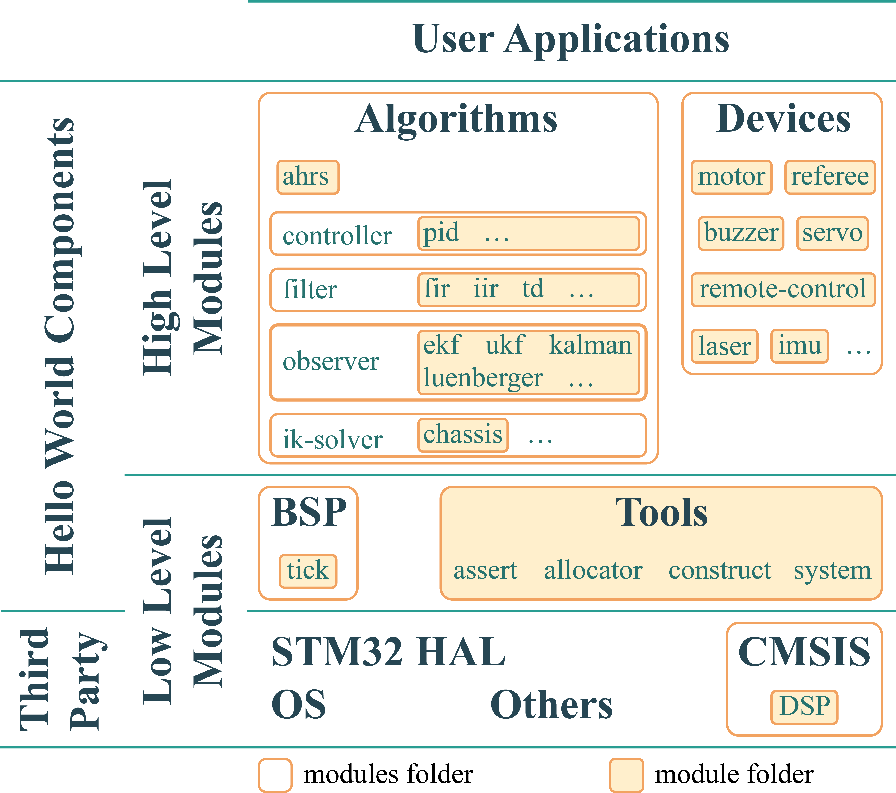

---
hide:
  - feedback
---

# 机器人通用组件

> 机器人通用组件源码仓库：<https://github.com/ZJU-HelloWorld/HW-Components>，对应分支为`cpp24`

## 组件库架构

<figure markdown>
{width=90%}
<caption>Hello World 战队电控组件库架构</caption>
</figure>
战队组件库架构如图所示。框架在结构上简单分为三层：基础模块层（Low Level Modules）、高级模块层（High Level Modules）和用户应用层（User Applications）。整体使用的设计模式是**结构层级模式**，上层模块通过组装不同的下层模块实现更强大的功能，最终由用户（各兵种电控）自由选取、调用并开发兵种代码。

基础模块层是板级支持包（BSP，Board Support Package）以及通用函数的集合，提供对开发板外设、软件管理以及与硬件无关的函数，便于上层模块的开发。

高级模块层由算法模块和设备模块组成，其中各模块功能或不依赖硬件实现或通过基础模块实现。

组件库通过文件夹和 `CMakeLists.txt` 进行模块的管理和编译。模块文件夹（在架构图中所示的 module folder）都可以单独编译为静态库，并在最终的编译过程中进行链接。基于此特性，在链接时，用户可以选择使用这些模块预编译的静态库文件来加快编译速度。由此发散，这些模块可以单独使用 `MinSizeRel` 级别进行编译，而用户待调试的程序则使用 `Debug` 级别进行编译。用户可以在用于工程编译的 `CMakeLists.txt` 中设置是否启用某个模块和是否采用预编译的静态库。此外，有些模块还提供额外的宏定义选项，用户也可以在 `CMakeLists.txt` 进行配置。

## 主要文件夹介绍

### 核心工具（tools）

各种实用功能的聚合，包括内存管理（部分与硬件和操作系统有关）和各种通用函数。

### 硬件外设（bsp）

缩减范围的板级支持包，仅提供对开发板外设的软件抽象，让其他模块层能使用抽象接口进行数据处理与交互。

### 算法（algorithms）

涵盖了机器人开发相关的各类数学计算、信号处理及控制算法实现。

### 设备应用（devices）

为组成机器人的一系列设备产品编写，封装了对应设备的属性和应用方法。

* 按照架构设计，设备应用应接入设备管理中间件，该中间件用于在系统中创建设备对象，并抽象出统一的驱动接口供应用调用。
* 设备管理中间件提供的方法依赖于外设驱动支持，详见“嵌入式系统支持”说明。

## 编译系统

前文已经提及组件库通过 `CMakeLists.txt` 进行各模块的编译管理，此处将开始详细叙述管理方式。

组件库中的 `CMakeLists.txt` 按功能有三种：组件库顶层调用、多模组遍历、模组编译。注意，这些文件并不能直接用于用户的工程编译，用户需要在自己的工程下自行编写用于编译整个工程的 `CMakeLists.txt`（可参考开发指南中给出的模板）。

* 组件库顶层调用：设置组件库的基本属性，加载通用的函数和宏，遍历子文件夹并调用其中的 `CMakeLists.txt` ，通过全局属性传递各模块的公开和接口头文件和由各模块编译得到的静态库的名称。
* 多模组遍历：遍历子文件夹并调用其中的 `CMakeLists.txt`，，通过全局属性传递各模块的公开和接口头文件和由各模块编译得到的静态库的名称。
* 模组编译：根据路径自动设置模块库名称，通常有两个可选属性 `use_${lib_name}`  和 `use_prebuilt_${lib_name}` 来控制是否对此模块进行编译以及是否使用预编译的静态库，通过全局属性传递各模块的公开和接口头文件和由各模块编译得到的静态库的名称。所有模块的可配置属性及其默认值都记载在 `config.cmake` ，需要用户在工程编译的 `CMakeLists.txt` 中加载。如果需要进行对应设置的更改，建议在工程编译 `CMakeLists.txt` 之中 `include("${HWC_DIR}/config.cmake")` 的语句之后添加 `set(the_config  the_new_value)`，而不是在 `config.cmake` 中进行更改。