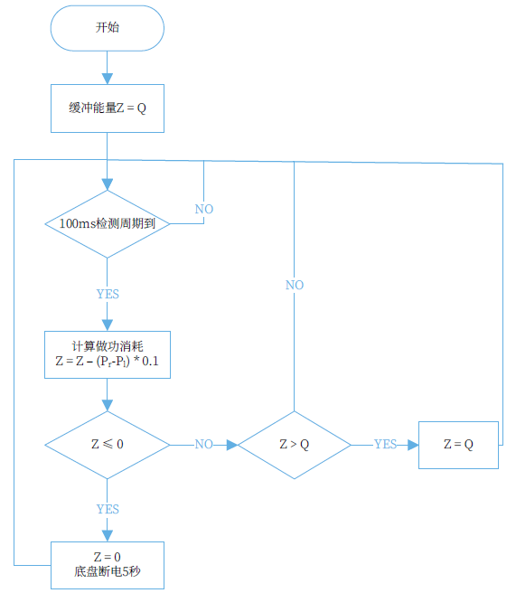
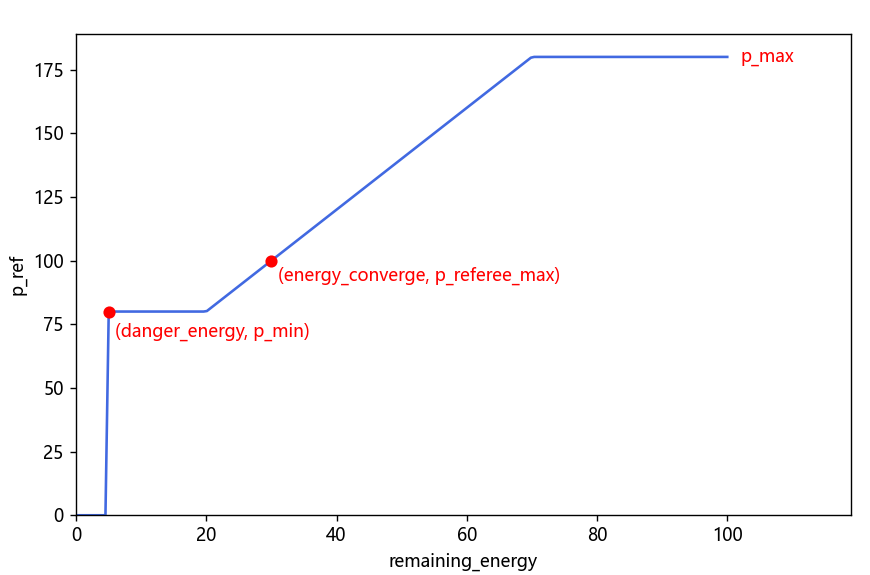

# 底盘功率限制

 

## 理论

### 相关规则介绍

RoboMaster 对抗赛相关规则针对英雄、工程、步兵和哨兵设置了底盘功率限制，机器人底盘需在功率限制范围内运行。

裁判系统持续监控机器人底盘功率，机器人底盘需在功率限制范围内运行。地面机器人底盘功率超限时，该机器人将扣除缓冲能量。当缓冲能量耗尽，底盘功率仍超限时，底盘会被断电 5 秒。裁判系统进行底盘功率检测的结算频率是 10 Hz。

设定 $Z$ 为缓冲能量，$Q$ 为缓冲能量上限，$P_r$ 为瞬时底盘输出功率，$P_l$ 为上限功率。$Q=60J$
机器人底盘功率检测及超限惩罚机制如下方框图所示：



官方文档对于底盘功率的具体定义为：
机器人产生水平方向上平移、旋转运动的动力系统的功率，不包含完成特殊任务时使用的动力系统的功率（例如：活动上层机械结构、足式机器人的关节电机、攀登台阶或跨越障碍等功能性动作所消耗的功率）。因此，与底盘水平方向移动相关机械结构的动力系统的执行机构使用电源产生的功率全部计入底盘功率。比如，用于调节底盘驱动电机方向或者其他储能机械结构（包括但不限于：弹簧、气动系统、皮筋、拉簧等）的电机、舵机、电磁开关等。

常见的计入底盘功率的电机有：轮电机、舵轮底盘的舵电机等

### 电机功率模型

基于大量实测数据，我们采用的电机瞬时功率经验模型如下：

$$
P_{\text{model}} = k_1 \cdot I \cdot \omega + k_2 \cdot I^2 + k_3 \cdot |\omega|
$$

其中：

- $I$ 为电机转矩电流；
- $\omega$ 为电机角速度；
- $k_1$、$k_2$、$k_3$ 为拟合得到的系数。

### 期望功率规划

为了充分利用超电或缓冲能量，我们会根据当前底盘剩余能量实时规划期望功率。目标是在剩余能量较多时，用较高的底盘功率实现底盘的加速，便于后续的地形跨越（起伏路段、飞坡、下台阶）；在剩余能量较少时，期望功率应低于规定的功率上限，避免超电过放或裁判系统的超功率惩罚；特别地，在剩余能量低于最低阈值时，期望功率降为 0，强制关闭输出，作为最后保险。

实际应用中，期望功率与剩余能量的关系大致为一个有上下限幅的一次函数关系，可以调节对应参数适配不同的需求:

$$
P_{\text{ref}} =
\begin{cases}
0, & x < E_{\text{danger}} \\[6pt]
\text{clip}\Big( P_{\text{referee_max}} + p_{\text{slope}} (E_{\text{remain}} - E_{\text{converge}}),
\, P_{\text{ref_min}},\, P_{\text{ref_max}} \Big), & x \ge E_{\text{danger}}
\end{cases}
$$

其中：

- $P_{\text{ref}}$ 为期望功率
- $P_{\text{referee_max}}$ 为裁判系统给出的功率上限
- $P_{\text{ref_max}}$ 为期望功率上限，一般依据地形跨越需求设定
- $P_{\text{ref_min}}$ 为期望功率下限，一般设为 $P_{\text{referee_max}} * 0.8$ 
- $E_{\text{remain}}$ 为当前剩余能量，在安装超电时，指超电的剩余电量，反之为裁判系统缓冲能量
- $E_{\text{danger}}$ 为危险能量值，当剩余能量低于该值时，$P_{\text{ref}}= 0$ 
- $E_{\text{converge}}$ 为能量收敛值，当剩余能量达到该值时，期望功率为裁判系统给出的最大功率限制 $P_{\text{referee_max}}$ 
- $p_{\text{slope}}$ 为能量与期望功率的斜率，可根据需求调节，尽量让能量充足时 $P_{\text{ref}}$ 达到上限 $P_{\text{ref_max}}$

函数图像如下图所示：



扣除静息功率$P_{\text{bias}}$后再根据设定比例$p_{\text{steering_ratio}}$分配给轮电机和舵电机

### 求解削减系数

当预测出的电机功率大于期望功率时，需要同比例削减电机输出以降低功率，设削减系数为 $k_{\text{limit}}$。

#### 舵电机计算电流削减系数
对于舵电机，同比例削减各电机输出转矩电流。

对于**作负功**的电机（输出力矩方向与电机转动方向相反），不限制其电流。负功的绝对值记为 $P_{\text{negative}}$。

根据电机功率模型：

$$
P_{\text{ref}} + P_{\text{negative}} = \sum \left( k_1 \cdot I_{\text{limited}} \cdot \omega + k_2 \cdot I_{\text{limited}}^2 + k_3 \cdot |\omega| \right)
$$

将 $I_{\text{limited}} = k_{\text{limit}} \cdot I$ 代入，可以得到关于 k_{\text{limit}} 的一元二次方程：

$$
\sum \left(k_2 \cdot I^2 \right) \cdot k_{\text{limit}}^2
+ \sum \left(k_1 \cdot \omega \cdot I \right) \cdot k_{\text{limit}}
+ \sum \left(k_3 \cdot |\omega| \right) - P_{\text{ref}} - P_{\text{negative}} = 0
$$

代入求根公式，即可以求解出电流削减系数 $k_{limit}$。

#### 轮电机计算转速削减系数

对于轮电机，同比例削减所有电机目标转速，以保证底盘运动方向不变。

这里假设轮电机使用P控制器加前馈的方法控制，即：

$$
I = k_p * (\omega_{\text{ref}} - \omega) + I_{\text{ffd}}
$$

对速度进行限幅，有：

$$
I_{\text{limited}} = k_p * (k_{\text{limit}} \cdot \omega_{\text{ref}} - \omega) + I_{\text{ffd}}
$$

计算整体功率，同样反解二次方程得到转速削减系数 $k_{limit}$。

## 快速开始

组件源码仓库地址：<https://github.com/ZJU-HelloWorld/HW-Components>

ins_pwr_limiter.hpp 示例：

```c++
#ifndef INS_PWR_LIMITER_HPP_
#define INS_PWR_LIMITER_HPP_

#include "power_limiter.hpp"

namespace hw_pwr_limiter = hello_world::power_limiter;

hw_pwr_limiter::PowerLimiter* GetPwrLimiterIns(void);

#endif  /* INS_PWR_LIMITER_HPP_ */
```

ins_pwr_limiter.cpp 示例：

```c++
#include "ins_pwr_limiter.hpp"

const hw_pwr_limiter::PowerLimiterStaticParams kPwrLimiterStaticParams = {
    .wheel_motor_params =
    {
        .k1 = 0.259f,         ///< Iω 项系数 
        .k2 = 0.106f,         ///< I^2 项系数
        .k3 = 0.169f,         ///< fabsf(ω) 项系数
        .kp = 1.95f,          ///< 与轮电机 kp 相同，使用电流输入
        .out_limit = 20.0f,   ///< 输出限幅，单位：A
        .motor_cnt = 4,       ///< 轮电机数量
    },
    .steering_motor_params = 
    {
        .k1 = 0.65f,          ///< Iω 项系数 
        .k2 = 5.78f,          ///< I^2 项系数
        .k3 = 0.0f,           ///< fabsf(ω) 项系数
        .out_limit = 3.0f,    ///< 输出限幅，单位：A
        .motor_cnt = 4,       ///< 舵电机数量
    },
    .p_bias = 5.3f,           ///< 底盘静息功率，单位：W
    .p_steering_ratio = 0.5f, ///< 分配给舵电机的功率比例，非舵轮底盘为 0，范围：[0, 1]
};

hw_pwr_limiter::PowerLimiter unique_pwr_limiter = hw_pwr_limiter::PowerLimiter(kPwrLimiterStaticParams);

hw_pwr_limiter::PowerLimiter* GetPwrLimiterIns(void) { return &unique_pwr_limiter; }
```

在 chassis.cpp 中，输入实时状态数据，计算削减后的控制量，部分示例代码如下：

```c++
void Chassis::runOnWorking() {
  revNormCmd();
  calcMotorRef();           // 先进行底盘解算
  calcRudderCurrentRef();   // PID 计算舵电机输出电流 （非舵轮底盘不需要）
  calcMotorLimitedRef();    // 计算功率限制
  calcWheelCurrentRef();    // 根据限制后轮速计算轮电机输出电流
  setCommData(true);
};

void Chassis::calcMotorLimitedRef() {
  // 更新轮电机数据，若无前馈 wheel_ffd_ 可填 nullptr
  // wheel_current_fdb_ 仅用于 debug，可填 nullptr
  pwr_limiter_ptr_->updateWheelModel(wheel_speed_ref_, wheel_speed_fdb_, wheel_ffd_, wheel_current_fdb_); 

  // 更新舵电机数据，rudder_current_fdb_ 仅用于 debug，可填 nullptr
  pwr_limiter_ptr_->updateSteeringModel(rudder_speed_fdb_, rudder_current_ref_, rudder_current_fdb_);

  // 更新状态参数
  PwrLimiter::RuntimeParams runtime_params = {
      .p_ref_max = rfr_data_.pwr_limit * 1.2f,
      .p_referee_max = static_cast<float>(rfr_data_.pwr_limit),
      .p_ref_min = rfr_data_.pwr_limit * 0.8f,
      // 无超电填裁判系统缓冲能量，有超电填超电剩余电量
      .remaining_energy =static_cast<float>(rfr_data_.pwr_buffer),
      .energy_converge = 20.0f,
      .p_slope = 1.5f,
      .danger_energy = 5.0f,
  };

  // 计算削减后控制量
  pwr_limiter_ptr_->calc(runtime_params, wheel_limited_speed_ref_, rudder_limited_current_ref_);

  // 导出单个电机功率模型，用于 debug
  auto model = pwr_limiter_ptr_->getWheelMotorModel(0);
};
```

## 调试技巧

### 功率模型参数调节
新版电源管理模块取消了瞬时功率的反馈，因此调节功率模型参数调节需要先连上服务器，点开对应的兵种，可以看到功率曲线

需要调节的参数有：

| 参数 | 意义 |
| ------ | ------ |
| k1   | Iω 项系数 |
| k2   | I^2 项系数 |
| k3   | fabsf(ω) 项系数 |
| p_bias | 静息功率 |

1. 将所有模型参数置零，设置 p_ref_max = p_ref_min = 60，使得底盘能够以恒功率运行
2. 不开遥控器，此时功率即静息功率
3. 抵住车体，让轮电机堵转，此时底盘功率只与 k2 有关，调整 k2 使得 pwr_limiter_ptr_->datas().p_limited 与功率曲线贴合良好，即功率曲线贴近预设的恒功率值 60W
4. 前后低速开车，调节 k1
5. 高速开车，调节 k3，补偿高速时的模型误差，使功率曲线水平
6. 综合测试，最终功率曲线接近一条水平直线，误差 $\pm 5$ W以内，可能会稍微偏高，不影响正常使用


## 注意事项 （出 bug 了看这里）
- 轮电机和舵电机均使用电流输入（GM6020 电机需要接上位机切换），单位 A
- 轮电机控制不能有 $k_i$ 和 $k_d$，否则预测输出会与实际输出不一致，如使用前馈，一定要填到 updateWheelModel 参数中
- 调轮电机 PID 以后，一定要记得在功率限制参数中更新
- 正常使用时，保证 p_ref_min < p_referee_max < p_ref_max
- 轮电机更改减速比后，需要重新调节功率模型参数（通常k2不用调，k1，k3除以减速比）
- 安装了超级电容后，缓冲能量控制由超电控制板负责，如果在超电仍有电量的时候出现了超功率，找硬件联调
- 履带电机、平衡轮电机功率限制待完善


## 附录

### 版本说明

| 版本号                                                       | 发布日期   | 说明                                                         | 贡献者                           |
| ------------------------------------------------------------ | ---------- | ------------------------------------------------------------ | -------------------------------- |
|  | 2021.12.06 | 完成新版功率限制研发，采用简单模型                           | 薛东来                           |
|  | 2022.07.17 | 配合新超电逻辑联调，整理代码                                 | 薛东来                           |
|  | 2023.01.11 | 修改估计细节，完善模型                                       | 薛东来                           |
|  | 2023.05.17 | 1. 拟合曲线<br />2. 测试并修正电机输出电流超限问题以及km估计不准问题<br />3. 结合超电逻辑完善 | 薛东来 赵炜                      |
|  | 2024.09.01 | 1.添加连续性优化<br />2.补充方程求解逻辑<br />3.更改期望电流计算方法<br />4.完善测试数字超电控制<br />5.测试舵轮与全向轮的功率限制效果 | 薛东来 杨舟 王彦程 蔡坤镇 蔡佳怡 |
|  | 2025.10.25 | 1.舵轮功率分配<br />2.改进功率模型<br />3.重构代码 | 金乐天 白林颖 |