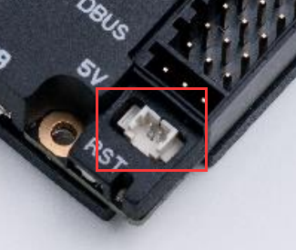

# 红点激光器（Laser）设备组件

 <sp> 

## 理论

RoboMaster RL35 红点激光器是专为 RoboMaster 机器人设计的一款辅助瞄准设备，可发射出点状、出瞳光束为 5 mm 的红色激光以辅助瞄准，如下图所示：


使用时，将电源线（红色为正极，黑色为负极）接入开发板电压为 5V 的直流电源接口。可以直接操作引脚来开关设备；或通过 PWM 调节占空比以改变输出电压，来控制红点激光器亮度（对预分频值没有要求）。

> 以 RoboMaster 开发板 C 型为例，板上已集成一个可控的激光专用 5V 电源接口，如下图所示：
>
>  
>
> 对应的开关控制 IO 为 PC8，PWM 由 `TIM3 CHANNEL3` 输出。

## 快速开始

组件源码仓库地址：<https://github.com/ZJU-HelloWorld/HW-Components>

### 外设驱动配置

在使用 PWM 波控制红点激光器时，使用 CubeMX 配置时将对应定时器调整至合理频率（如 1kHz）。例如对于RoboMaster 开发板 C 型板载的红点激光器，驱动流程如下：

* 对于 TIM3，查看数据手册可知其挂载在 APB1 总线上，时钟频率 84MHz，为达到 1kHz 的频率 ，可将预分频值（Prescaler）设置为 83，计数周期（Counter Period）设置为 999。


### 使用前准备

使用前需要做以下准备：

* 在使用 STM32CubeMX 生成项目时，请在 `Code Generator` 界面 `Enable Full Assert`，来帮助断言设备驱动中的错误；在 `main.c` 中修改 `assert_failed` 函数以指示断言结果，如添加 `while(1);`
* 在 `config.cmake` 文件中设置 `use_hwcomponents_devices_laser` 选项为 `ON`，开启该设备文件的编译

### 示例

在项目中引用头文件：

```cpp
#include "laser.hpp"
```

实例化一个红点激光器设备并初始化，默认使能，如：

```cpp
namespace laser = hello_world::devices::laser;

laser::Laser* laser_ptr = nullptr;
laser_ptr = new laser::Laser(&htim3, TIM_CHANNEL_3, lumin);
```

设定红点激光器亮度百分数（0 - 100）：

```cpp
float lumin = 50; // 设置亮度百分数为50%
laser_ptr->setLuminPct(lumin);
```


### 组件说明

#### `Laser` 类


##### public

属性

| 名称               | 类型                 | 示例值        | 描述           |
| :----------------- | :------------------- | :------------ | :------------- |
| `kHtim_`             | `TIM_HandleTypeDef* const` | &htim3        | 定时器句柄指针           |
| `kChannel_`           | `const uint32_t`           | TIM_CHANNEL_3 | 定时器 PWM 输出通道           |

方法

| 名称 | 参数说明                               | 描述                                   |
| :------------------- | :------------------------------------- | -------------------------------------- |
|`Laser`|`htim` 定时器句柄指针</br>`channel`: 定时器 PWM 对应输出通道</br>`init_lumin_pct`: 初始化百分比亮度（0 ~ 100）|初始化红点激光器并开启|
|`~Laser`|/|红点激光器析构函数|
|`enable`|/|启用红点激光器|
|`disable`|/|关闭红点激光器|
|`setLuminPct`|`lumin_pct`: 百分比亮度（0 ~ 100）|设置红点激光器百分比亮度|

##### private

方法

| 名称 | 参数说明                               | 描述                                   |
| :------------------- | :------------------------------------- | -------------------------------------- |
| `luminPct2Cmp`          | `lumin_pct`: 百分比亮度（0 ~ 100）</br>返回: 定时器PWM比较值 |百分比亮度转定时器 PWM 比较值|


## 附录

### 版本说明

| 版本号                                                       | 发布日期   | 说明               | 贡献者 |
| ------------------------------------------------------------ | ---------- | ------------------ | ------ |
|  | 2022.12.07 | 发布红点激光器组件 | 薛东来 |
|  | 2023.12.10 | 发布红点激光器组件(Cpp) | 蔡坤镇 |