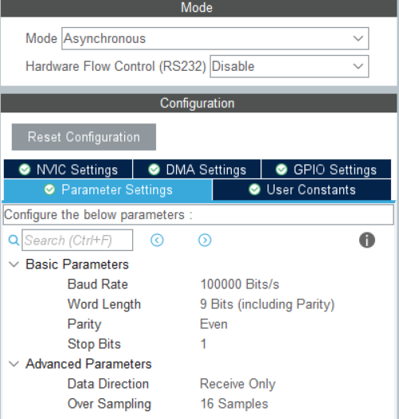

# 遥控器（Remote Control）设备组件

<sp> 

## 理论

DT7 遥控器是一款工作于 2.4 GHz 频段的无线电通信设备，该遥控器仅能与 DR16 接收机配合使用。如下图所示：


使用时，将 DR16 的接口接到 Dbus 接口，以实现对遥控器指令的读取。

> 以 RoboMaster 开发板 C 型为例，板上已集成一个 Dbus 接口，如下图所示：
>
>  
>
> 对应的接收引脚为 `PC11`，信号由 `UART3` 接收。

## 快速开始

组件源码仓库地址：<https://github.com/ZJU-HelloWorld/HW-Components>

### 外设驱动配置

在使用 Dbus 接收遥控器指令时，使用 CubeMX 配置时将对应串口波特率调整至 100k，偶校验。例如对于 RoboMaster 开发板 C 型板载的 Dbus，驱动流程如下：

* 对于 USART3，将波特率配置为 100000Bit/s，字长 9Bits (including Parity)，校验位偶校验（Even），数据方向为只接收（Receive Only）。



* 同时开启串口的 DMA 接收，并开启 USART3 的中断

### 使用前准备

使用前需要做以下准备：

* 在使用 STM32CubeMX 生成项目时，请在 `Code Generator` 界面 `Enable Full Assert`，来帮助断言设备驱动中的错误；在 `main.c` 中修改 `assert_failed` 函数以指示断言结果，如添加 `while(1);`
* 在 `config.cmake` 文件中设置 `use_hwcomponents_devices_remote_control` 选项为 `ON`，开启该设备文件的编译

### 示例

在项目中引用头文件：

```cpp
#include "DT7.hpp"
```

实例化一个遥控器设备并开启串口 DMA 接收至空闲帧，如：

```cpp
namespace rc = hello_world::devices::remote_control;

static uint8_t rx_buf[remote_control::kRcRxDataLen];

rc::DT7* rc_ptr;
rc_ptr = new rc::DT7;

HAL_UARTEx_ReceiveToIdle_DMA(&huart3, rx_buf, rc::kRcRxDataLen);
```

重写串口接收事件中断：

```cpp
void HAL_UARTEx_RxEventCallback(UART_HandleTypeDef* huart, uint16_t Size)
{
  if (huart == &huart3) {
    if (Size == rc::kRcRxDataLen) {
      rc_ptr->decode(rx_buf);
    }

    HAL_UARTEx_ReceiveToIdle_DMA(&huart3, rx_buf, rc::kRcRxDataLen);
  }
}
```

然后可通过对应的类方法获取遥控器指令：

```cpp
if (rc_ptr->rc_l_switch() == rc::kSwitchStateUp) {
  // ...
}
```


### 组件说明

#### `DT7` 类


##### public

方法

| 名称 | 参数说明                               | 描述                                   |
| :------------------- | :------------------------------------- | -------------------------------------- |
|`DT7`|/|DT7 遥控器构造函数|
|`~DT7`|/|DT7 遥控器析构函数|
|`decode`|`rx_data`: 接收到的数据|将接收到的数据解包|
|`rc_*`|/|/|
|`mouse_*`|/|/|
|`mouse_*_btn`|`reset`: 读取后是否将该键复位|/|
|`key_*`|`reset`: 读取后是否将该键复位|/|

##### private

属性

| 名称               | 类型                 | 示例值        | 描述           |
| :----------------- | :------------------- | :------------ | :------------- |
|`rc_lv_`|`float`|0|遥控器左摇杆竖直值，[-1, 1]|
|`rc_lh_`|`float`|0|遥控器左摇杆水平值，[-1, 1]|
|`rc_rv_`|`float`|0|遥控器右摇杆竖直值，[-1, 1]|
|`rc_rh_`|`float`|0|遥控器右摇杆水平值，[-1, 1]|
|`rc_wheel_`|`float`|0|遥控器拨轮值，[-1, 1]|
|`rc_l_switch_`|`SwitchState`|`kSwitchStateUp`|遥控器左拨杆值|
|`rc_r_switch_`|`SwitchState`|`kSwitchStateUp`|遥控器右拨杆值|
|`mouse_l_btn_`|`bool`|`false`|鼠标左键是否按下|
|`mouse_r_btn_`|`bool`|`false`|鼠标右键是否按下|
|`mouse_x_`|`int16_t`|0|鼠标 x 轴数值|
|`mouse_y_`|`int16_t`|0|鼠标 y 轴数值|
|`mouse_z_`|`int16_t`|0|鼠标 z 轴数值|
|`key_.*`|`uint16_t : 1`|1|键盘按键*是否按下|

## 附录

### 版本说明

| 版本号                                                       | 发布日期   | 说明               | 贡献者 |
| ------------------------------------------------------------ | ---------- | ------------------ | ------ |
|  | 2023.12.12 | 发布遥控器组件（Cpp） | 蔡坤镇 |