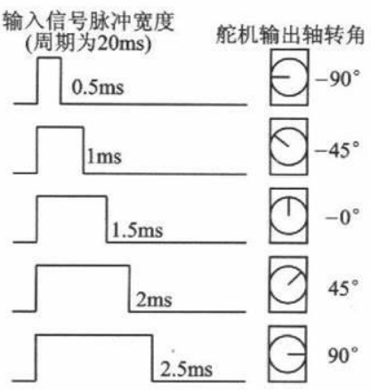

# 舵机（Servo）设备组件

  <sp>  

## 理论

舵机是机器人中的常见的执行部件，通常使用特定频率的 PWM 进行控制。舵机的主要组成部位由一个小型的电机和传动机构（齿轮组）构成，多被用于操控飞行器上的舵面，故而得名舵机。由于控制简单，价格便宜，在 RoboMaster 比赛中，用于简单的动作控制，例如使用舵机控制弹仓盖的开合。下图为市场上常见的舵机。


通常舵机的三根线按照颜色分别为：黑色 - GND，红色 - VCC，黄色 - PWM 信号。在使用舵机时，只需要使用杜邦线或者其他连接线接入开发板 C 型对应的 PWM 接口。

舵机使用的 PWM 信号一般为频率 50Hz，高电平时间 0.5ms - 2.5ms 的 PWM 信号，不同占空比的 PWM 信号对应舵机转动的角度，以 180 度舵机为例，对应角度图如下图所示。



在开发板上具有 7 个 PWM 的输出接口，原理图和实物图如图所示。


在使用 PWM 波控制舵机时，需要注意查阅舵机参数，并在使用 CubeMX 时将对应定时器预分频至 1MHz. 例如对一个工作频率 50Hz - 300Hz 的舵机，工作脉宽 500us - 2500us，工作角度 0° -180°，连接至 TIM1 CHANNEL1，驱动流程如下：

* 对于 TIM1，查看数据手册可知其挂载在 APB2 总线上，时钟频率 168MHz，为达到 1MHz 需要 168 分频 ，因此将预分频值（Prescaler）设置为 167；
* 工作频率定为 50Hz，对应周期为 20ms (20000us)，因此重载值（Counter Period）设置为 19999。此“工作频率”选项可在组件初始化时更改，CubeMX 配置随意；
* 设置初始高电平时间即脉宽（Pulse），一般最小为 0.5ms，即 500us，占空比 2.5%，对应了最小角度 0°；最大为 2.5ms，即 2500us，占空比 12.5%，对应了最大角度 180°. 此“初始角度”选项可在组件初始化时更改，“角度”选项可在组件运行时更改，CubeMX 配置随意。

## 快速开始

组件源码仓库地址：<https://github.com/ZJU-HelloWorld/HW-Components>

要在项目中使用该组件，需添加仓库内的以下文件：

```
Devices/dev_servo.c
Devices/dev_servo.h
Devices/dev_config.h
system.h
```

### 使用前准备

使用前需要做以下准备：

* 在使用 STM32CubeMX 生成项目时，请在 `Code Generator` 界面 `Enable Full Assert`，来帮助断言算法中的错误
* 在 `main.c` 中修改 `assert_failed` 函数以指示断言结果
* 在 `system.h` 中 `system options: user config` 处进行系统设置

### 示例

在项目中引用头文件：

```c
#include "dev_servo.h"
```

实例化一个舵机设备：

```c
Servo_t servo;
```

创建参数结构体数组，初始化舵机设备：

```c
ServoInfo_t info =
{
  .angle_range_deg = 180,
  .init_angle_deg = 0,
  .min_pulse_width_us = 500,
  .max_pulse_width_us = 2500,
  .operating_freq_hz = 50
};

ServoInit(&servo, &HTIM_PWM1, HTIM_PWM_CH1, &info);
```

设定舵机角度：

```c
servo.setAngle(&servo, angle_deg);
```


### 组件说明

#### `Servo` 类

参数

| 名称     | 类型                 | 示例值        | 描述     |
| :------- | :------------------- | :------------ | :------- |
| `htim`   | `TIM_HandleTypeDef*` | &htim1        | 时钟     |
| `tim_ch` | `uint16_t`           | TIM_CHANNEL_1 | 频道     |
| `info`   | `ServoInfo_t*`       | /             | 相关参数 |

方法

| 名称 | 参数说明                                                     | 描述                                  |
| :------------------ | :----------------------------------------------------------- | ------------------------------------- |
| `ServoInit` | 传入时钟句柄指针、频道、相关参数结构体指针 | 用传入的参数初始化一个舵机设备。 |
| `enable`     | / | 使能舵机设备。 |
| `disable`        | / | 失能舵机设备。 |
| `setAngle`    | 传入目标角度值 | 控制舵机旋转至目标角度。 |
| `setMaxAngle` | /                                                           | 控制舵机旋转至最大角度。 |
| `setMinAngle`        | /                                          | 控制舵机旋转至最小角度。  |

#### `ServoInfo` 结构体

存储舵机相关参数。

| 名称 | 类型 | 示例值 | 描述                        |
| :------------------- | :------------------- | :----- | :-------------------------- |
| `operating_freq_hz`  | `float`              | 50     | 执行频率                    |
| `min_pulse_width_us` | `uint16_t`           | 500    | 最小角度对应脉宽            |
| `max_pulse_width_us` | `uint16_t`           | 2500   | 最大角度对应脉宽            |
| `angle_range_deg`    | `uint16_t`           | 180    | 极限角度范围，默认从 0 开始 |
| `init_angle_deg`     | `float`              | 1.5    | 初始角度                    |


## 附录

### 版本说明

| 版本号                                                       | 发布日期   | 说明         | 贡献者 |
| ------------------------------------------------------------ | ---------- | ------------ | ------ |
|  | 2022.12.07 | 发布舵机组件 | 薛东来 |

### 参考资料

[1] RoboMaster 开发板 C 型嵌入式软件教程文档. [Github 仓库](https://github.com/RoboMaster/Development-Board-C-Examples)
